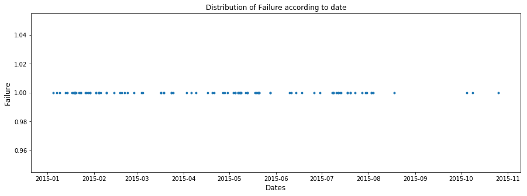
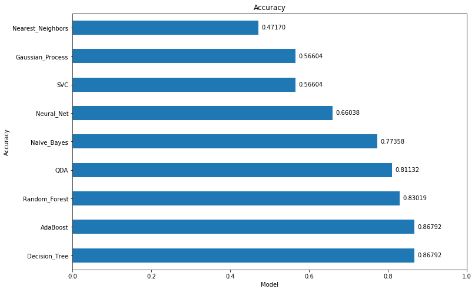
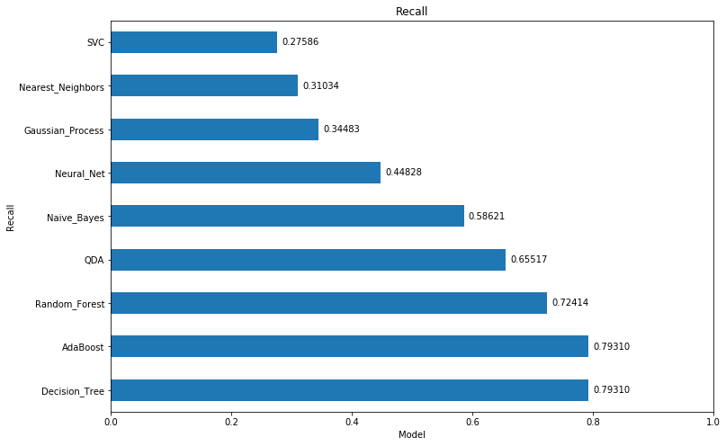
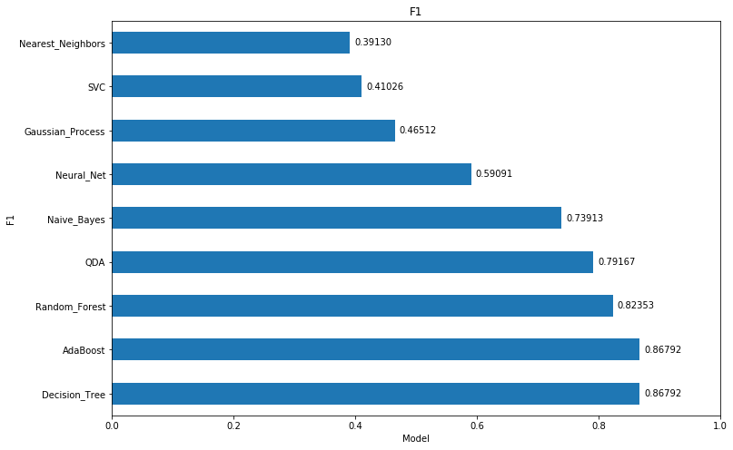
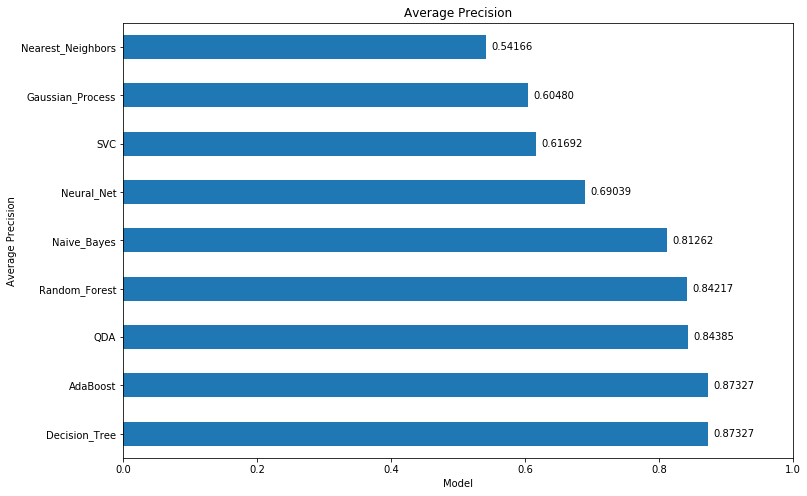
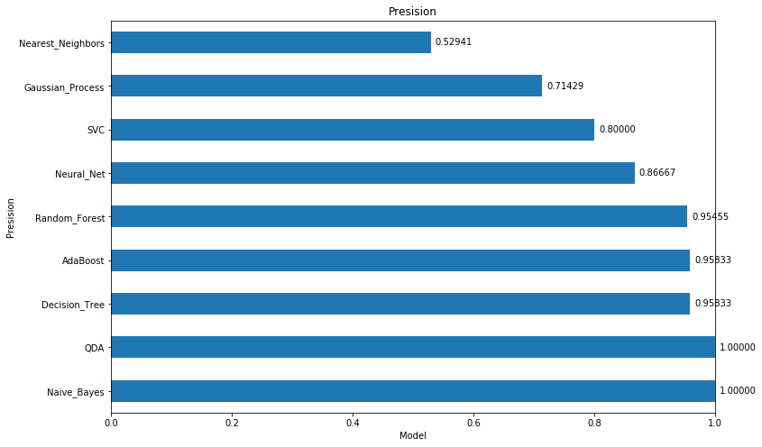
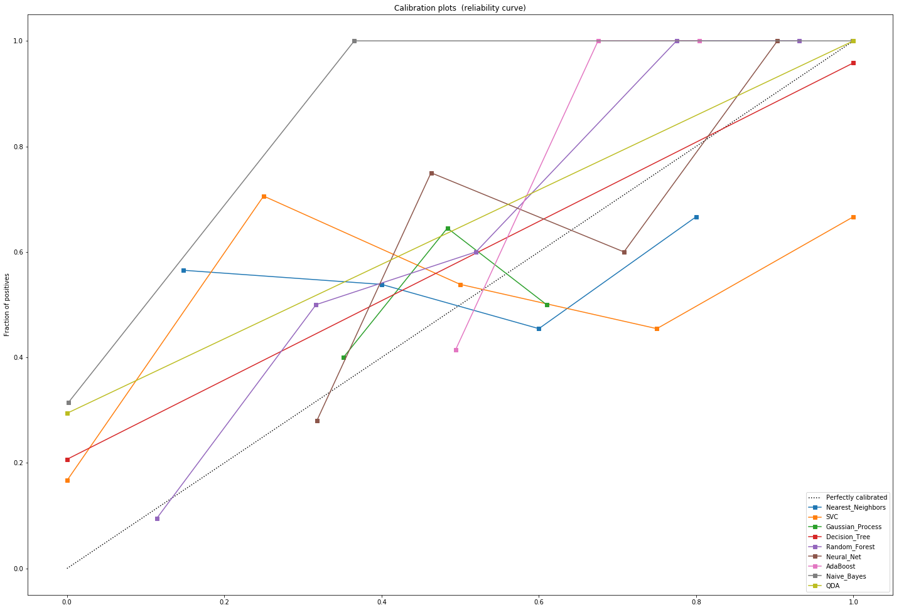

```python
#by luis.bazo@gmail.com
'''
This script reads a csv file with telemetry values from vehicules and performs different Machine Learning models to predict vehicule failures
#
# 1. Read the data from csv and initiate panda dataframe with the information
# 2. Transform data columns types into readable values by ML models (strings are mapped as objects and they can't be read by models)
# 3. Remove highly correlated columns. They don't provide any value to the model and reduce the efficiency and increase processing time
# 4. Assess majority class balance
#  4.a. Given that false failures are highly predominant, downsample majority class to balance possitive and negative
#  4.b. Scale data to standarize features magnitudes. That improves ML model training.
# 5. Split train data in x,y train and test datasets respectivelly 
# 6. Train/Fit models and get predicted values for the test dataset. A separate thread is created for every single model trainin run.
# 7. Plot different metrics with models performance and compare model calibration

'''
%matplotlib inline
import pandas as pd
from sklearn import preprocessing as scale
import matplotlib.pyplot as plt
import seaborn as sns
from scipy import stats
from sklearn.utils import resample
from sklearn.metrics import accuracy_score,recall_score, confusion_matrix, roc_curve, average_precision_score, precision_recall_curve, precision_score,f1_score
from sklearn.calibration import calibration_curve
from sklearn.metrics import roc_auc_score as AUC
from sklearn.model_selection import train_test_split
from sklearn.preprocessing import StandardScaler
from sklearn.datasets import make_moons, make_circles, make_classification
from sklearn.neural_network import MLPClassifier
from sklearn.neighbors import KNeighborsClassifier
from sklearn.svm import SVC
from sklearn.gaussian_process import GaussianProcessClassifier
from sklearn.gaussian_process.kernels import RBF
from sklearn.tree import DecisionTreeClassifier
from sklearn.ensemble import RandomForestClassifier, AdaBoostClassifier
from sklearn.naive_bayes import GaussianNB
from sklearn.discriminant_analysis import QuadraticDiscriminantAnalysis
from threading import Lock, Thread
from sklearn.decomposition import PCA
import sys
import warnings

```


```python
#Disable warnings. That lines should be comment if we want functiondeprecated and other warnings to be displayed
if not sys.warnoptions:
    warnings.simplefilter("ignore")
    
#Variables to be used 
accuracy_values = list()
accuracy_columns = list()
recall_values = list()
recall_columns = list()
precision_values = list()
precision_columns = list()
average_precision_values = list()
average_precision_columns = list()
f1_values = list()
f1_columns = list()
prob_pos = pd.DataFrame()

model_names = ["Nearest_Neighbors", "SVC", "Gaussian_Process",
         "Decision_Tree", "Random_Forest", "Neural_Net", "AdaBoost",
         "Naive_Bayes", "QDA"]
models = [    
    KNeighborsClassifier(),
    SVC(),
    GaussianProcessClassifier(),
    DecisionTreeClassifier(),
    RandomForestClassifier(),
    MLPClassifier(alpha=1),
    AdaBoostClassifier(),
    GaussianNB(),
    QuadraticDiscriminantAnalysis()]

#loading csv file into python
dataset = pd.read_csv('./device_failure.csv',encoding='unicode_escape')
```


```python
dataset.head(100)
```


<div>
<style scoped>
    .dataframe tbody tr th:only-of-type {
        vertical-align: middle;
    }

    .dataframe tbody tr th {
        vertical-align: top;
    }

    .dataframe thead th {
        text-align: right;
    }
</style>
<table border="1" class="dataframe">
  <thead>
    <tr style="text-align: right;">
      <th></th>
      <th>date</th>
      <th>device</th>
      <th>failure</th>
      <th>attribute1</th>
      <th>attribute2</th>
      <th>attribute3</th>
      <th>attribute4</th>
      <th>attribute5</th>
      <th>attribute6</th>
      <th>attribute7</th>
      <th>attribute8</th>
      <th>attribute9</th>
    </tr>
  </thead>
  <tbody>
    <tr>
      <th>0</th>
      <td>2015-01-01</td>
      <td>S1F01085</td>
      <td>0</td>
      <td>215630672</td>
      <td>56</td>
      <td>0</td>
      <td>52</td>
      <td>6</td>
      <td>407438</td>
      <td>0</td>
      <td>0</td>
      <td>7</td>
    </tr>
    <tr>
      <th>1</th>
      <td>2015-01-01</td>
      <td>S1F0166B</td>
      <td>0</td>
      <td>61370680</td>
      <td>0</td>
      <td>3</td>
      <td>0</td>
      <td>6</td>
      <td>403174</td>
      <td>0</td>
      <td>0</td>
      <td>0</td>
    </tr>
    <tr>
      <th>2</th>
      <td>2015-01-01</td>
      <td>S1F01E6Y</td>
      <td>0</td>
      <td>173295968</td>
      <td>0</td>
      <td>0</td>
      <td>0</td>
      <td>12</td>
      <td>237394</td>
      <td>0</td>
      <td>0</td>
      <td>0</td>
    </tr>
    <tr>
      <th>3</th>
      <td>2015-01-01</td>
      <td>S1F01JE0</td>
      <td>0</td>
      <td>79694024</td>
      <td>0</td>
      <td>0</td>
      <td>0</td>
      <td>6</td>
      <td>410186</td>
      <td>0</td>
      <td>0</td>
      <td>0</td>
    </tr>
    <tr>
      <th>4</th>
      <td>2015-01-01</td>
      <td>S1F01R2B</td>
      <td>0</td>
      <td>135970480</td>
      <td>0</td>
      <td>0</td>
      <td>0</td>
      <td>15</td>
      <td>313173</td>
      <td>0</td>
      <td>0</td>
      <td>3</td>
    </tr>
    <tr>
      <th>5</th>
      <td>2015-01-01</td>
      <td>S1F01TD5</td>
      <td>0</td>
      <td>68837488</td>
      <td>0</td>
      <td>0</td>
      <td>41</td>
      <td>6</td>
      <td>413535</td>
      <td>0</td>
      <td>0</td>
      <td>1</td>
    </tr>
    <tr>
      <th>6</th>
      <td>2015-01-01</td>
      <td>S1F01XDJ</td>
      <td>0</td>
      <td>227721632</td>
      <td>0</td>
      <td>0</td>
      <td>0</td>
      <td>8</td>
      <td>402525</td>
      <td>0</td>
      <td>0</td>
      <td>0</td>
    </tr>
    <tr>
      <th>7</th>
      <td>2015-01-01</td>
      <td>S1F023H2</td>
      <td>0</td>
      <td>141503600</td>
      <td>0</td>
      <td>0</td>
      <td>1</td>
      <td>19</td>
      <td>494462</td>
      <td>16</td>
      <td>16</td>
      <td>3</td>
    </tr>
    <tr>
      <th>8</th>
      <td>2015-01-01</td>
      <td>S1F02A0J</td>
      <td>0</td>
      <td>8217840</td>
      <td>0</td>
      <td>1</td>
      <td>0</td>
      <td>14</td>
      <td>311869</td>
      <td>0</td>
      <td>0</td>
      <td>0</td>
    </tr>
    <tr>
      <th>9</th>
      <td>2015-01-01</td>
      <td>S1F02DZ2</td>
      <td>0</td>
      <td>116440096</td>
      <td>0</td>
      <td>323</td>
      <td>9</td>
      <td>9</td>
      <td>407905</td>
      <td>0</td>
      <td>0</td>
      <td>164</td>
    </tr>
    <tr>
      <th>10</th>
      <td>2015-01-01</td>
      <td>S1F02EVN</td>
      <td>0</td>
      <td>112348104</td>
      <td>0</td>
      <td>0</td>
      <td>0</td>
      <td>7</td>
      <td>388146</td>
      <td>0</td>
      <td>0</td>
      <td>1</td>
    </tr>
    <tr>
      <th>11</th>
      <td>2015-01-01</td>
      <td>S1F02L38</td>
      <td>0</td>
      <td>223938928</td>
      <td>0</td>
      <td>0</td>
      <td>0</td>
      <td>2</td>
      <td>215169</td>
      <td>0</td>
      <td>0</td>
      <td>8</td>
    </tr>
    <tr>
      <th>12</th>
      <td>2015-01-01</td>
      <td>S1F02MGA</td>
      <td>0</td>
      <td>44399688</td>
      <td>0</td>
      <td>266</td>
      <td>1</td>
      <td>6</td>
      <td>399286</td>
      <td>0</td>
      <td>0</td>
      <td>2269</td>
    </tr>
    <tr>
      <th>13</th>
      <td>2015-01-01</td>
      <td>S1F02P76</td>
      <td>0</td>
      <td>104131304</td>
      <td>1536</td>
      <td>0</td>
      <td>175</td>
      <td>11</td>
      <td>301679</td>
      <td>0</td>
      <td>0</td>
      <td>0</td>
    </tr>
    <tr>
      <th>14</th>
      <td>2015-01-01</td>
      <td>S1F02VAX</td>
      <td>0</td>
      <td>61019512</td>
      <td>168</td>
      <td>2</td>
      <td>521</td>
      <td>3</td>
      <td>380496</td>
      <td>0</td>
      <td>0</td>
      <td>3</td>
    </tr>
    <tr>
      <th>15</th>
      <td>2015-01-01</td>
      <td>S1F02WFT</td>
      <td>0</td>
      <td>44348552</td>
      <td>5160</td>
      <td>14</td>
      <td>1074</td>
      <td>11</td>
      <td>249515</td>
      <td>0</td>
      <td>0</td>
      <td>21</td>
    </tr>
    <tr>
      <th>16</th>
      <td>2015-01-01</td>
      <td>S1F0318A</td>
      <td>0</td>
      <td>35018688</td>
      <td>0</td>
      <td>0</td>
      <td>0</td>
      <td>9</td>
      <td>394890</td>
      <td>0</td>
      <td>0</td>
      <td>5</td>
    </tr>
    <tr>
      <th>17</th>
      <td>2015-01-01</td>
      <td>S1F0322R</td>
      <td>0</td>
      <td>34540712</td>
      <td>0</td>
      <td>0</td>
      <td>0</td>
      <td>9</td>
      <td>411399</td>
      <td>0</td>
      <td>0</td>
      <td>0</td>
    </tr>
    <tr>
      <th>18</th>
      <td>2015-01-01</td>
      <td>S1F0330P</td>
      <td>0</td>
      <td>125539768</td>
      <td>0</td>
      <td>0</td>
      <td>12</td>
      <td>14</td>
      <td>297284</td>
      <td>0</td>
      <td>0</td>
      <td>5</td>
    </tr>
    <tr>
      <th>19</th>
      <td>2015-01-01</td>
      <td>S1F035SJ</td>
      <td>0</td>
      <td>220392160</td>
      <td>0</td>
      <td>0</td>
      <td>0</td>
      <td>9</td>
      <td>389730</td>
      <td>0</td>
      <td>0</td>
      <td>0</td>
    </tr>
    <tr>
      <th>20</th>
      <td>2015-01-01</td>
      <td>S1F0377V</td>
      <td>0</td>
      <td>166567552</td>
      <td>0</td>
      <td>0</td>
      <td>23</td>
      <td>14</td>
      <td>321308</td>
      <td>0</td>
      <td>0</td>
      <td>8</td>
    </tr>
    <tr>
      <th>21</th>
      <td>2015-01-01</td>
      <td>S1F039FE</td>
      <td>0</td>
      <td>218786520</td>
      <td>0</td>
      <td>0</td>
      <td>6</td>
      <td>4</td>
      <td>394782</td>
      <td>0</td>
      <td>0</td>
      <td>2</td>
    </tr>
    <tr>
      <th>22</th>
      <td>2015-01-01</td>
      <td>S1F03RV3</td>
      <td>0</td>
      <td>176851840</td>
      <td>0</td>
      <td>0</td>
      <td>0</td>
      <td>8</td>
      <td>258058</td>
      <td>0</td>
      <td>0</td>
      <td>0</td>
    </tr>
    <tr>
      <th>23</th>
      <td>2015-01-01</td>
      <td>S1F03YZM</td>
      <td>0</td>
      <td>55587136</td>
      <td>0</td>
      <td>0</td>
      <td>0</td>
      <td>7</td>
      <td>199132</td>
      <td>0</td>
      <td>0</td>
      <td>0</td>
    </tr>
    <tr>
      <th>24</th>
      <td>2015-01-01</td>
      <td>S1F044ET</td>
      <td>0</td>
      <td>161730848</td>
      <td>0</td>
      <td>0</td>
      <td>0</td>
      <td>5</td>
      <td>226578</td>
      <td>0</td>
      <td>0</td>
      <td>0</td>
    </tr>
    <tr>
      <th>25</th>
      <td>2015-01-01</td>
      <td>S1F049RX</td>
      <td>0</td>
      <td>181980928</td>
      <td>0</td>
      <td>0</td>
      <td>4</td>
      <td>7</td>
      <td>395719</td>
      <td>0</td>
      <td>0</td>
      <td>0</td>
    </tr>
    <tr>
      <th>26</th>
      <td>2015-01-01</td>
      <td>S1F04DH8</td>
      <td>0</td>
      <td>134506192</td>
      <td>0</td>
      <td>9</td>
      <td>0</td>
      <td>16</td>
      <td>324354</td>
      <td>0</td>
      <td>0</td>
      <td>145</td>
    </tr>
    <tr>
      <th>27</th>
      <td>2015-01-01</td>
      <td>S1F04KSC</td>
      <td>0</td>
      <td>105234552</td>
      <td>392</td>
      <td>24929</td>
      <td>529</td>
      <td>3</td>
      <td>339205</td>
      <td>0</td>
      <td>0</td>
      <td>10137</td>
    </tr>
    <tr>
      <th>28</th>
      <td>2015-01-01</td>
      <td>S1F04MVQ</td>
      <td>0</td>
      <td>41356960</td>
      <td>1984</td>
      <td>0</td>
      <td>46</td>
      <td>4</td>
      <td>367145</td>
      <td>0</td>
      <td>0</td>
      <td>65</td>
    </tr>
    <tr>
      <th>29</th>
      <td>2015-01-01</td>
      <td>S1F04R7Y</td>
      <td>0</td>
      <td>126680112</td>
      <td>0</td>
      <td>0</td>
      <td>0</td>
      <td>7</td>
      <td>398672</td>
      <td>0</td>
      <td>0</td>
      <td>51</td>
    </tr>
    <tr>
      <th>...</th>
      <td>...</td>
      <td>...</td>
      <td>...</td>
      <td>...</td>
      <td>...</td>
      <td>...</td>
      <td>...</td>
      <td>...</td>
      <td>...</td>
      <td>...</td>
      <td>...</td>
      <td>...</td>
    </tr>
    <tr>
      <th>70</th>
      <td>2015-01-01</td>
      <td>S1F0CWHW</td>
      <td>0</td>
      <td>181849512</td>
      <td>368</td>
      <td>0</td>
      <td>0</td>
      <td>4</td>
      <td>320211</td>
      <td>0</td>
      <td>0</td>
      <td>9</td>
    </tr>
    <tr>
      <th>71</th>
      <td>2015-01-01</td>
      <td>S1F0CWKN</td>
      <td>0</td>
      <td>127130528</td>
      <td>0</td>
      <td>0</td>
      <td>0</td>
      <td>4</td>
      <td>338123</td>
      <td>0</td>
      <td>0</td>
      <td>0</td>
    </tr>
    <tr>
      <th>72</th>
      <td>2015-01-01</td>
      <td>S1F0CWXJ</td>
      <td>0</td>
      <td>126520680</td>
      <td>6336</td>
      <td>0</td>
      <td>1</td>
      <td>4</td>
      <td>286446</td>
      <td>0</td>
      <td>0</td>
      <td>0</td>
    </tr>
    <tr>
      <th>73</th>
      <td>2015-01-01</td>
      <td>S1F0DKAN</td>
      <td>0</td>
      <td>229757712</td>
      <td>0</td>
      <td>0</td>
      <td>0</td>
      <td>6</td>
      <td>257378</td>
      <td>0</td>
      <td>0</td>
      <td>0</td>
    </tr>
    <tr>
      <th>74</th>
      <td>2015-01-01</td>
      <td>S1F0DSTY</td>
      <td>0</td>
      <td>8471680</td>
      <td>0</td>
      <td>0</td>
      <td>0</td>
      <td>11</td>
      <td>436682</td>
      <td>0</td>
      <td>0</td>
      <td>0</td>
    </tr>
    <tr>
      <th>75</th>
      <td>2015-01-01</td>
      <td>S1F0E9EP</td>
      <td>0</td>
      <td>106791400</td>
      <td>0</td>
      <td>0</td>
      <td>0</td>
      <td>8</td>
      <td>196552</td>
      <td>0</td>
      <td>0</td>
      <td>0</td>
    </tr>
    <tr>
      <th>76</th>
      <td>2015-01-01</td>
      <td>S1F0EEP2</td>
      <td>0</td>
      <td>134846800</td>
      <td>0</td>
      <td>0</td>
      <td>0</td>
      <td>13</td>
      <td>241377</td>
      <td>0</td>
      <td>0</td>
      <td>0</td>
    </tr>
    <tr>
      <th>77</th>
      <td>2015-01-01</td>
      <td>S1F0EGMT</td>
      <td>0</td>
      <td>84554144</td>
      <td>0</td>
      <td>0</td>
      <td>0</td>
      <td>9</td>
      <td>196324</td>
      <td>0</td>
      <td>0</td>
      <td>0</td>
    </tr>
    <tr>
      <th>78</th>
      <td>2015-01-01</td>
      <td>S1F0EGSH</td>
      <td>0</td>
      <td>40237712</td>
      <td>0</td>
      <td>0</td>
      <td>0</td>
      <td>11</td>
      <td>217110</td>
      <td>0</td>
      <td>0</td>
      <td>0</td>
    </tr>
    <tr>
      <th>79</th>
      <td>2015-01-01</td>
      <td>S1F0F4EB</td>
      <td>0</td>
      <td>239412320</td>
      <td>0</td>
      <td>0</td>
      <td>0</td>
      <td>9</td>
      <td>200197</td>
      <td>0</td>
      <td>0</td>
      <td>2</td>
    </tr>
    <tr>
      <th>80</th>
      <td>2015-01-01</td>
      <td>S1F0F4G4</td>
      <td>0</td>
      <td>211877800</td>
      <td>0</td>
      <td>0</td>
      <td>0</td>
      <td>10</td>
      <td>285843</td>
      <td>0</td>
      <td>0</td>
      <td>2</td>
    </tr>
    <tr>
      <th>81</th>
      <td>2015-01-01</td>
      <td>S1F0FGBQ</td>
      <td>0</td>
      <td>22235264</td>
      <td>0</td>
      <td>0</td>
      <td>0</td>
      <td>9</td>
      <td>170595</td>
      <td>0</td>
      <td>0</td>
      <td>0</td>
    </tr>
    <tr>
      <th>82</th>
      <td>2015-01-01</td>
      <td>S1F0FP0C</td>
      <td>0</td>
      <td>170455152</td>
      <td>0</td>
      <td>0</td>
      <td>0</td>
      <td>9</td>
      <td>199551</td>
      <td>0</td>
      <td>0</td>
      <td>0</td>
    </tr>
    <tr>
      <th>83</th>
      <td>2015-01-01</td>
      <td>S1F0FVBE</td>
      <td>0</td>
      <td>220310848</td>
      <td>0</td>
      <td>0</td>
      <td>0</td>
      <td>14</td>
      <td>287997</td>
      <td>0</td>
      <td>0</td>
      <td>0</td>
    </tr>
    <tr>
      <th>84</th>
      <td>2015-01-01</td>
      <td>S1F0FW8K</td>
      <td>0</td>
      <td>148364576</td>
      <td>0</td>
      <td>0</td>
      <td>0</td>
      <td>92</td>
      <td>219483</td>
      <td>0</td>
      <td>0</td>
      <td>0</td>
    </tr>
    <tr>
      <th>85</th>
      <td>2015-01-01</td>
      <td>S1F0FZ8F</td>
      <td>0</td>
      <td>131456656</td>
      <td>0</td>
      <td>0</td>
      <td>0</td>
      <td>7</td>
      <td>196271</td>
      <td>0</td>
      <td>0</td>
      <td>0</td>
    </tr>
    <tr>
      <th>86</th>
      <td>2015-01-01</td>
      <td>S1F0G0XX</td>
      <td>0</td>
      <td>199608968</td>
      <td>0</td>
      <td>0</td>
      <td>0</td>
      <td>12</td>
      <td>286864</td>
      <td>0</td>
      <td>0</td>
      <td>0</td>
    </tr>
    <tr>
      <th>87</th>
      <td>2015-01-01</td>
      <td>S1F0G9ZF</td>
      <td>0</td>
      <td>298304</td>
      <td>0</td>
      <td>0</td>
      <td>0</td>
      <td>70</td>
      <td>220132</td>
      <td>0</td>
      <td>0</td>
      <td>0</td>
    </tr>
    <tr>
      <th>88</th>
      <td>2015-01-01</td>
      <td>S1F0GCED</td>
      <td>0</td>
      <td>236579432</td>
      <td>0</td>
      <td>0</td>
      <td>0</td>
      <td>8</td>
      <td>200873</td>
      <td>0</td>
      <td>0</td>
      <td>0</td>
    </tr>
    <tr>
      <th>89</th>
      <td>2015-01-01</td>
      <td>S1F0GG8X</td>
      <td>0</td>
      <td>38395328</td>
      <td>1232</td>
      <td>0</td>
      <td>0</td>
      <td>11</td>
      <td>187467</td>
      <td>0</td>
      <td>0</td>
      <td>2</td>
    </tr>
    <tr>
      <th>90</th>
      <td>2015-01-01</td>
      <td>S1F0GGJD</td>
      <td>0</td>
      <td>729312</td>
      <td>0</td>
      <td>0</td>
      <td>0</td>
      <td>62</td>
      <td>193739</td>
      <td>0</td>
      <td>0</td>
      <td>0</td>
    </tr>
    <tr>
      <th>91</th>
      <td>2015-01-01</td>
      <td>S1F0GGPP</td>
      <td>0</td>
      <td>183315424</td>
      <td>0</td>
      <td>0</td>
      <td>0</td>
      <td>9</td>
      <td>199329</td>
      <td>0</td>
      <td>0</td>
      <td>0</td>
    </tr>
    <tr>
      <th>92</th>
      <td>2015-01-01</td>
      <td>S1F0GHJ1</td>
      <td>0</td>
      <td>42570952</td>
      <td>0</td>
      <td>0</td>
      <td>0</td>
      <td>58</td>
      <td>220094</td>
      <td>0</td>
      <td>0</td>
      <td>0</td>
    </tr>
    <tr>
      <th>93</th>
      <td>2015-01-01</td>
      <td>S1F0GJL9</td>
      <td>0</td>
      <td>54378424</td>
      <td>0</td>
      <td>0</td>
      <td>0</td>
      <td>63</td>
      <td>222276</td>
      <td>0</td>
      <td>0</td>
      <td>0</td>
    </tr>
    <tr>
      <th>94</th>
      <td>2015-01-01</td>
      <td>S1F0GJW3</td>
      <td>0</td>
      <td>118683272</td>
      <td>0</td>
      <td>0</td>
      <td>0</td>
      <td>8</td>
      <td>201152</td>
      <td>0</td>
      <td>0</td>
      <td>0</td>
    </tr>
    <tr>
      <th>95</th>
      <td>2015-01-01</td>
      <td>S1F0GKFX</td>
      <td>0</td>
      <td>107148272</td>
      <td>0</td>
      <td>0</td>
      <td>0</td>
      <td>65</td>
      <td>223170</td>
      <td>0</td>
      <td>0</td>
      <td>0</td>
    </tr>
    <tr>
      <th>96</th>
      <td>2015-01-01</td>
      <td>S1F0GKL6</td>
      <td>0</td>
      <td>234778096</td>
      <td>0</td>
      <td>0</td>
      <td>0</td>
      <td>90</td>
      <td>221425</td>
      <td>0</td>
      <td>0</td>
      <td>0</td>
    </tr>
    <tr>
      <th>97</th>
      <td>2015-01-01</td>
      <td>S1F0GPFZ</td>
      <td>0</td>
      <td>53071760</td>
      <td>0</td>
      <td>0</td>
      <td>0</td>
      <td>8</td>
      <td>195262</td>
      <td>0</td>
      <td>0</td>
      <td>0</td>
    </tr>
    <tr>
      <th>98</th>
      <td>2015-01-01</td>
      <td>S1F0GPXY</td>
      <td>0</td>
      <td>22380768</td>
      <td>0</td>
      <td>0</td>
      <td>0</td>
      <td>8</td>
      <td>196205</td>
      <td>0</td>
      <td>0</td>
      <td>0</td>
    </tr>
    <tr>
      <th>99</th>
      <td>2015-01-01</td>
      <td>S1F0GQCL</td>
      <td>0</td>
      <td>113057752</td>
      <td>0</td>
      <td>0</td>
      <td>0</td>
      <td>92</td>
      <td>217629</td>
      <td>0</td>
      <td>0</td>
      <td>0</td>
    </tr>
  </tbody>
</table>
<p>100 rows × 12 columns</p>
</div>


```python
dataset.dtypes
```


    date          object
    device        object
    failure        int64
    attribute1     int64
    attribute2     int64
    attribute3     int64
    attribute4     int64
    attribute5     int64
    attribute6     int64
    attribute7     int64
    attribute8     int64
    attribute9     int64
    dtype: object


```python
le = scale.LabelEncoder()
dataset['device'] = le.fit_transform(dataset['device'])
#dataset['date'] = le.fit_transform(dataset['date'])
dataset['date'] = pd.to_datetime(dataset['date'])

#Remove rows with NA column information. Model don't work well with NA values
dataset.dropna(axis=0,inplace=True)
dataset.dtypes
```


    date          datetime64[ns]
    device                 int32
    failure                int64
    attribute1             int64
    attribute2             int64
    attribute3             int64
    attribute4             int64
    attribute5             int64
    attribute6             int64
    attribute7             int64
    attribute8             int64
    attribute9             int64
    dtype: object


```python
dataset.describe()
```


<div>
<style scoped>
    .dataframe tbody tr th:only-of-type {
        vertical-align: middle;
    }

    .dataframe tbody tr th {
        vertical-align: top;
    }

    .dataframe thead th {
        text-align: right;
    }
</style>
<table border="1" class="dataframe">
  <thead>
    <tr style="text-align: right;">
      <th></th>
      <th>device</th>
      <th>failure</th>
      <th>attribute1</th>
      <th>attribute2</th>
      <th>attribute3</th>
      <th>attribute4</th>
      <th>attribute5</th>
      <th>attribute6</th>
      <th>attribute7</th>
      <th>attribute8</th>
      <th>attribute9</th>
    </tr>
  </thead>
  <tbody>
    <tr>
      <th>count</th>
      <td>124494.000000</td>
      <td>124494.000000</td>
      <td>1.244940e+05</td>
      <td>124494.000000</td>
      <td>124494.000000</td>
      <td>124494.000000</td>
      <td>124494.000000</td>
      <td>124494.000000</td>
      <td>124494.000000</td>
      <td>124494.000000</td>
      <td>124494.000000</td>
    </tr>
    <tr>
      <th>mean</th>
      <td>622.379191</td>
      <td>0.000851</td>
      <td>1.223881e+08</td>
      <td>159.484762</td>
      <td>9.940455</td>
      <td>1.741120</td>
      <td>14.222669</td>
      <td>260172.657726</td>
      <td>0.292528</td>
      <td>0.292528</td>
      <td>12.451524</td>
    </tr>
    <tr>
      <th>std</th>
      <td>327.177800</td>
      <td>0.029167</td>
      <td>7.045933e+07</td>
      <td>2179.657730</td>
      <td>185.747321</td>
      <td>22.908507</td>
      <td>15.943028</td>
      <td>99151.078547</td>
      <td>7.436924</td>
      <td>7.436924</td>
      <td>191.425623</td>
    </tr>
    <tr>
      <th>min</th>
      <td>0.000000</td>
      <td>0.000000</td>
      <td>0.000000e+00</td>
      <td>0.000000</td>
      <td>0.000000</td>
      <td>0.000000</td>
      <td>1.000000</td>
      <td>8.000000</td>
      <td>0.000000</td>
      <td>0.000000</td>
      <td>0.000000</td>
    </tr>
    <tr>
      <th>25%</th>
      <td>378.000000</td>
      <td>0.000000</td>
      <td>6.128476e+07</td>
      <td>0.000000</td>
      <td>0.000000</td>
      <td>0.000000</td>
      <td>8.000000</td>
      <td>221452.000000</td>
      <td>0.000000</td>
      <td>0.000000</td>
      <td>0.000000</td>
    </tr>
    <tr>
      <th>50%</th>
      <td>602.000000</td>
      <td>0.000000</td>
      <td>1.227974e+08</td>
      <td>0.000000</td>
      <td>0.000000</td>
      <td>0.000000</td>
      <td>10.000000</td>
      <td>249799.500000</td>
      <td>0.000000</td>
      <td>0.000000</td>
      <td>0.000000</td>
    </tr>
    <tr>
      <th>75%</th>
      <td>917.000000</td>
      <td>0.000000</td>
      <td>1.833096e+08</td>
      <td>0.000000</td>
      <td>0.000000</td>
      <td>0.000000</td>
      <td>12.000000</td>
      <td>310266.000000</td>
      <td>0.000000</td>
      <td>0.000000</td>
      <td>0.000000</td>
    </tr>
    <tr>
      <th>max</th>
      <td>1168.000000</td>
      <td>1.000000</td>
      <td>2.441405e+08</td>
      <td>64968.000000</td>
      <td>24929.000000</td>
      <td>1666.000000</td>
      <td>98.000000</td>
      <td>689161.000000</td>
      <td>832.000000</td>
      <td>832.000000</td>
      <td>18701.000000</td>
    </tr>
  </tbody>
</table>
</div>


```python
def corr_df(x, corr_val):
    '''
    Obj: Drops features that are strongly correlated to other features.
          This lowers model complexity, and aids in generalizing the model.
    Inputs:
          df: features df (x)
          corr_val: Columns are dropped relative to the corr_val input (e.g. 0.8)
    Output: df that only includes uncorrelated features
    '''
    
    # Creates Correlation Matrix and Instantiates
    corr_matrix = x.corr()
    iters = range(len(corr_matrix.columns))
    drop_cols = []
    
    # Iterates through Correlation Matrix Table to find correlated columns
    for i in iters:
        for j in range(i):
            item = corr_matrix.iloc[j:(j+1), (i):(i+1)]
            col = item.columns
            row = item.index
            val = item.values
            if val >= corr_val:
                # Prints the correlated feature set and the corr val
                print("Related columns have been found " , col.values[0], "|", row.values[0], "| with correlation coeficient ", round(val[0][0], 2))
                print("Removing column ", col.values[0], " from dataset")
                drop_cols.append(col.values[0])
  

    # Drops the correlated columns
    df = x.drop(drop_cols, axis=1)
    return df
```


```python
#Remove high correlated columns/features
data = corr_df (dataset,0.8)
data.describe()
```

    Related columns have been found  attribute8 | attribute7 | with correlation coeficient  1.0
    Removing column  attribute8  from dataset
    


<div>
<style scoped>
    .dataframe tbody tr th:only-of-type {
        vertical-align: middle;
    }

    .dataframe tbody tr th {
        vertical-align: top;
    }

    .dataframe thead th {
        text-align: right;
    }
</style>
<table border="1" class="dataframe">
  <thead>
    <tr style="text-align: right;">
      <th></th>
      <th>device</th>
      <th>failure</th>
      <th>attribute1</th>
      <th>attribute2</th>
      <th>attribute3</th>
      <th>attribute4</th>
      <th>attribute5</th>
      <th>attribute6</th>
      <th>attribute7</th>
      <th>attribute9</th>
    </tr>
  </thead>
  <tbody>
    <tr>
      <th>count</th>
      <td>124494.000000</td>
      <td>124494.000000</td>
      <td>1.244940e+05</td>
      <td>124494.000000</td>
      <td>124494.000000</td>
      <td>124494.000000</td>
      <td>124494.000000</td>
      <td>124494.000000</td>
      <td>124494.000000</td>
      <td>124494.000000</td>
    </tr>
    <tr>
      <th>mean</th>
      <td>622.379191</td>
      <td>0.000851</td>
      <td>1.223881e+08</td>
      <td>159.484762</td>
      <td>9.940455</td>
      <td>1.741120</td>
      <td>14.222669</td>
      <td>260172.657726</td>
      <td>0.292528</td>
      <td>12.451524</td>
    </tr>
    <tr>
      <th>std</th>
      <td>327.177800</td>
      <td>0.029167</td>
      <td>7.045933e+07</td>
      <td>2179.657730</td>
      <td>185.747321</td>
      <td>22.908507</td>
      <td>15.943028</td>
      <td>99151.078547</td>
      <td>7.436924</td>
      <td>191.425623</td>
    </tr>
    <tr>
      <th>min</th>
      <td>0.000000</td>
      <td>0.000000</td>
      <td>0.000000e+00</td>
      <td>0.000000</td>
      <td>0.000000</td>
      <td>0.000000</td>
      <td>1.000000</td>
      <td>8.000000</td>
      <td>0.000000</td>
      <td>0.000000</td>
    </tr>
    <tr>
      <th>25%</th>
      <td>378.000000</td>
      <td>0.000000</td>
      <td>6.128476e+07</td>
      <td>0.000000</td>
      <td>0.000000</td>
      <td>0.000000</td>
      <td>8.000000</td>
      <td>221452.000000</td>
      <td>0.000000</td>
      <td>0.000000</td>
    </tr>
    <tr>
      <th>50%</th>
      <td>602.000000</td>
      <td>0.000000</td>
      <td>1.227974e+08</td>
      <td>0.000000</td>
      <td>0.000000</td>
      <td>0.000000</td>
      <td>10.000000</td>
      <td>249799.500000</td>
      <td>0.000000</td>
      <td>0.000000</td>
    </tr>
    <tr>
      <th>75%</th>
      <td>917.000000</td>
      <td>0.000000</td>
      <td>1.833096e+08</td>
      <td>0.000000</td>
      <td>0.000000</td>
      <td>0.000000</td>
      <td>12.000000</td>
      <td>310266.000000</td>
      <td>0.000000</td>
      <td>0.000000</td>
    </tr>
    <tr>
      <th>max</th>
      <td>1168.000000</td>
      <td>1.000000</td>
      <td>2.441405e+08</td>
      <td>64968.000000</td>
      <td>24929.000000</td>
      <td>1666.000000</td>
      <td>98.000000</td>
      <td>689161.000000</td>
      <td>832.000000</td>
      <td>18701.000000</td>
    </tr>
  </tbody>
</table>
</div>


```python
Failure = data[data.failure==1]
notRelevantColumns = ['failure']
    
#Initial data analysis on feature date agains failure
plt.figure(figsize=(15,5))
plt.plot(Failure['date'].sort_values(),Failure['failure'],".")
plt.title("Distribution of Failure according to date")
plt.ylabel('Failure', fontsize=12)
plt.xlabel('Dates', fontsize=12)

#Remove date, assuming is installation date, as it there seems to be not relation with failure
notRelevantColumns.extend(['date'])

```





```python
def MajorityClassIsBalanced (data,feature):
    for i in data[feature].value_counts(normalize=True).tolist():
        if (i < 0.6):
            return False
```


```python
#Downsample train data if needed to preserve train data balance as much as possible

if not MajorityClassIsBalanced (data,'failure'):
    
    #very low majority class occurrences -> downsampling data.
    df_nonfailure = data[data['failure'] == 0]
    df_failure = data[data['failure']==1]
    df_nonfailure_downsample = resample(df_nonfailure,replace=False,n_samples = 106,\
                                        random_state=23)
    df_resampled = pd.concat([df_nonfailure_downsample,df_failure])

    data_Outcome = df_resampled['failure']
    #scaling cat and cont data
    

    #dropping unwanted columns
    #That needs to be validated with customer as they might want to keep some of them
    df_resampled = df_resampled.drop(notRelevantColumns,axis = 1)
    standard_sc = scale.StandardScaler()
    x_std = standard_sc.fit_transform(df_resampled)
    data_scaled = pd.DataFrame(x_std)
    
    #pca = PCA()
    #principalComponents = pca.fit_transform(data_scaled)
    #principalDf = pd.DataFrame(data = principalComponents)
    #print (pca.explained_variance_ratio_)
    
    #split data into test and train
    xtrain,xtest,ytrain,ytest = train_test_split(data_scaled,data_Outcome,test_size=0.25,random_state =19)
    #xtrain,xtest,ytrain,ytest = train_test_split(principalDf,data_Outcome,test_size=0.25,random_state =19)
else:
    #dropping unwanted columns
    #That needs to be validated with customer as they might want to keep some of them
    data = data.drop(notRelevantColumns,axis = 1)
    standard_sc = scale.StandardScaler()
    x_std = standard_sc.fit_transform(data)
    data = pd.DataFrame(x_std)
    
    #pca = PCA()
    #principalComponents = pca.fit_transform(data)
    #principalDf = pd.DataFrame(data = principalComponents)
    #print (pca.explained_variance_ratio_)
    
    #split data into test and train
    xtrain,xtest,ytrain,ytest = train_test_split(data,data['failure'],test_size=0.25,random_state =19)
```


```python
def runModel (model,model_name, xtrain, ytrain, xtest):
    '''
    runModel runs model fit and prediction for the train and test x,y dataframes provided 
    and extracts performance metrics from the model executed (accuracy, recall, precision, average precision, f1 and probability)
    
    Metric score values are made global to later use when plotting all the metrics together to compare them
    '''
    model_dt = model.fit(xtrain,ytrain)
    pred_dt=model_dt.predict(xtest)
    #Metrics(ytest,pred_dt)
    global accuracy_values
    global accuracy_columns
    global recall_values
    global recall_columns
    global precision_values
    global precision_columns
    global average_precision_values
    global average_precision_columns
    global f1_values
    global f1_columns
    global prob_pos
    accuracy_values.append(accuracy_score(ytest,pred_dt))
    accuracy_columns.append(model_name)
    recall_values.append(recall_score(ytest,pred_dt))
    recall_columns.append(model_name)
    precision_values.append(precision_score(ytest,pred_dt))
    precision_columns.append(model_name)
    f1_values.append(f1_score(ytest,pred_dt))
    f1_columns.append(model_name)
    average_precision_values.append(average_precision_score(ytest,pred_dt))
    average_precision_columns.append(model_name)
    if hasattr(model_dt, "predict_proba"):
        prob_pos[model_name] = model_dt.predict_proba(xtest)[:, 1]
    else:  # use decision function
        prob_pos[model_name] = model_dt.decision_function(xtest)
        prob_pos[model_name] = (prob_pos - prob_pos.min()) / (prob_pos.max() - prob_pos.min())
    
    #print("********************** ", model_name, "*************************")
    #print(model_name, 'accuracy:', accuracy_score(ytest,pred_dt),',recall score:',recall_score(ytest,pred_dt))
    #print(model_name, 'precision: ', precision_score(ytest,pred_dt), ',av_precision_score: ', average_precision_score(ytest,pred_dt), ',f1_score: ', f1_score(ytest,pred_dt))
    #print(model_name, "\n", confusion_matrix(ytest,pred_dt))
    #print(model_dt.feature_importances_ )

```


```python
def plot_metrics (name, x, y):
    
    
    metric = pd.DataFrame({'x': x, 'y': y})
    metric.sort_values(by='y',ascending=False,inplace=True)
    print ("*******Metric ", name , " ************\n",metric)

    # Plot the figure.
    plt.figure(figsize=(12, 8))
    ax = metric.y.plot(kind='barh')
    ax.set_title(name)
    ax.set_xlabel('Metric Value')
    ax.set_ylabel(name)
    ax.set_yticklabels(metric.x)
    ax.set_xlim(0, 1) # expand xlim to make labels easier to read

    rects = ax.patches

    # For each bar: Place a label
    for rect in rects:
        # Get X and Y placement of label from rect.
        x_value = rect.get_width()
        y_value = rect.get_y() + rect.get_height() / 2

        # Number of points between bar and label. Change to your liking.
        space = 5
        # Vertical alignment for positive values
        ha = 'left'

        # If value of bar is negative: Place label left of bar
        if x_value < 0:
            # Invert space to place label to the left
            space *= -1
            # Horizontally align label at right
            ha = 'right'

        # Use X value as label and format number with one decimal place
        label = "{:.5f}".format(x_value)

        # Create annotation
        plt.annotate(
            label,                      # Use `label` as label
            (x_value, y_value),         # Place label at end of the bar
            xytext=(space, 0),          # Horizontally shift label by `space`
            textcoords="offset points", # Interpret `xytext` as offset in points
            va='center',                # Vertically center label
            ha=ha)                      # Horizontally align label differently for
                                    # positive and negative values.
    plt.show()
```


```python
#Run models creating a thread to run every single one. That speeds up the training process.
threads = list()


for model,model_name in zip(models,model_names):
    t = Thread(target=runModel, args=(model,model_name,xtrain,ytrain,xtest))
    threads.append(t)
    t.start()
    t.join()


```


```python
#Plot model metrics to assess ML model performance

plot_metrics("Accuracy",accuracy_columns,accuracy_values)
plot_metrics("Recall", recall_columns, recall_values)
plot_metrics("F1", f1_columns, f1_values)
plot_metrics("Average Precision", average_precision_columns, average_precision_values)
plot_metrics("Presision", precision_columns, precision_values)
```

    *******Metric  Accuracy  ************
                        x         y
    3      Decision_Tree  0.867925
    6           AdaBoost  0.867925
    4      Random_Forest  0.830189
    8                QDA  0.811321
    7        Naive_Bayes  0.773585
    5         Neural_Net  0.660377
    1                SVC  0.566038
    2   Gaussian_Process  0.566038
    0  Nearest_Neighbors  0.471698
    





    *******Metric  Recall  ************
                        x         y
    3      Decision_Tree  0.793103
    6           AdaBoost  0.793103
    4      Random_Forest  0.724138
    8                QDA  0.655172
    7        Naive_Bayes  0.586207
    5         Neural_Net  0.448276
    2   Gaussian_Process  0.344828
    0  Nearest_Neighbors  0.310345
    1                SVC  0.275862
    





    *******Metric  F1  ************
                        x         y
    3      Decision_Tree  0.867925
    6           AdaBoost  0.867925
    4      Random_Forest  0.823529
    8                QDA  0.791667
    7        Naive_Bayes  0.739130
    5         Neural_Net  0.590909
    2   Gaussian_Process  0.465116
    1                SVC  0.410256
    0  Nearest_Neighbors  0.391304
    





    *******Metric  Average Precision  ************
                        x         y
    3      Decision_Tree  0.873265
    6           AdaBoost  0.873265
    8                QDA  0.843852
    4      Random_Forest  0.842166
    7        Naive_Bayes  0.812622
    5         Neural_Net  0.690393
    1                SVC  0.616916
    2   Gaussian_Process  0.604796
    0  Nearest_Neighbors  0.541659
    





    *******Metric  Presision  ************
                        x         y
    7        Naive_Bayes  1.000000
    8                QDA  1.000000
    3      Decision_Tree  0.958333
    6           AdaBoost  0.958333
    4      Random_Forest  0.954545
    5         Neural_Net  0.866667
    1                SVC  0.800000
    2   Gaussian_Process  0.714286
    0  Nearest_Neighbors  0.529412
    





```python
def checkModelCalibration(X_train,X_test, y_train,y_test,models,model_name):
    
    plt.figure(figsize=(20, 20))
    ax1 = plt.subplot2grid((3, 1), (0, 0), rowspan=2)
    
    ax1.plot([0, 1], [0, 1], "k:", label="Perfectly calibrated")
    for clf,name in zip(models,model_names):
        fraction_of_positives, mean_predicted_value = calibration_curve(y_test, prob_pos[name], n_bins=5)
    
        ax1.plot(mean_predicted_value, fraction_of_positives, "s-",
                 label="%s" % (name, ))
    
    ax1.set_ylabel("Fraction of positives")
    ax1.set_ylim([-0.05, 1.05])
    ax1.legend(loc="lower right")
    ax1.set_title('Calibration plots  (reliability curve)')
    
    plt.tight_layout()
    plt.show()
```


```python
#Plot model calibration based in feature prediction probabilities as an additional metric of model performance
checkModelCalibration(xtrain,xtest, ytrain,ytest,models,model_name)

#Decision tree and Adaboost seems to be the best models with the train data that has been given for this exercise however
# Decision tree seems to be better callibrated
```




